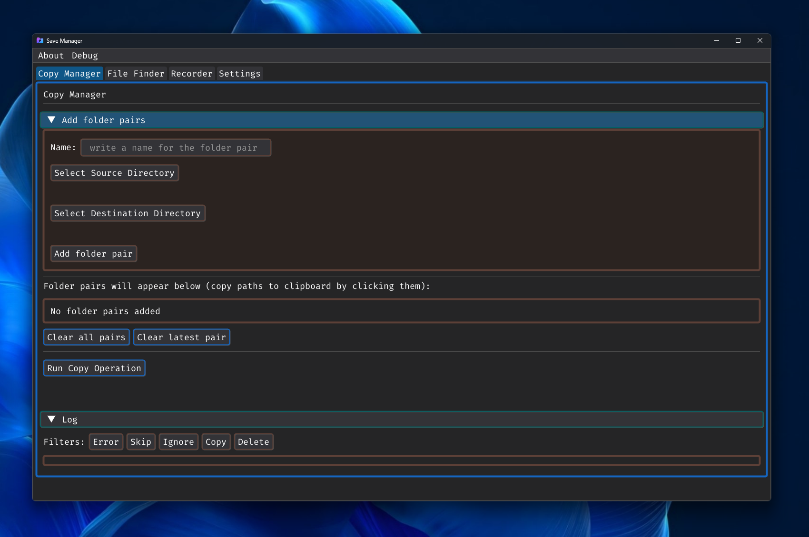
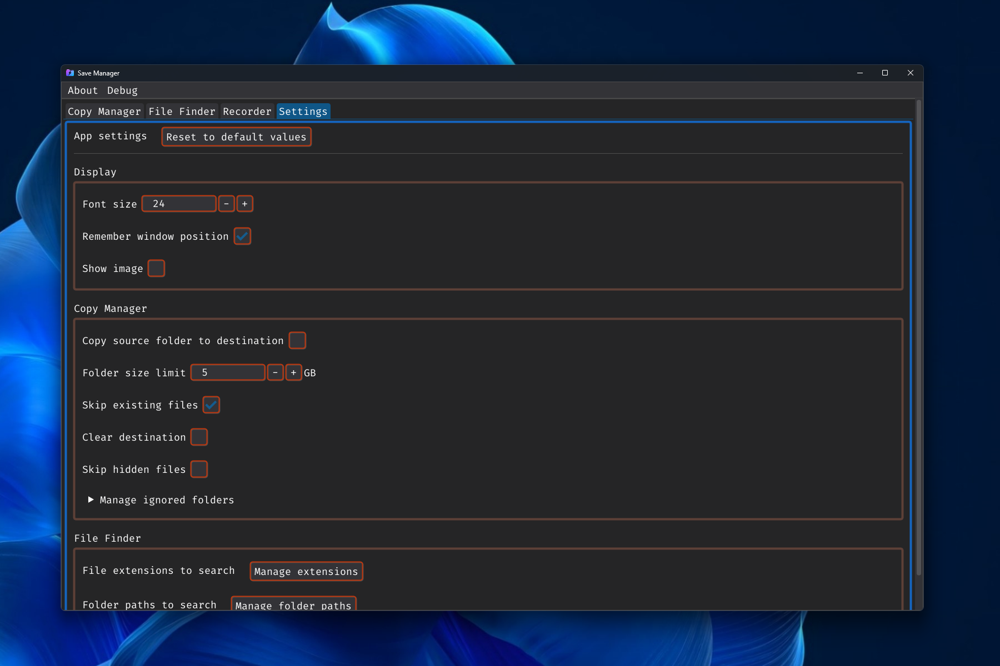

# Save Manager

## About
A simple Python application to save multiple folder pairs and copy them with the click of a button. 

## Other features
<ul>
  <li>File finder</li>
  <li>Screenshot tool</li>
  <li>Screen recorder</li>
</ul> 

## Images (taken using built-in screenshot tool)

  
  

## Installing

### Option 1 (installer, recommended):
1. Download Setup.exe from releases
2. Run the file

The installer will download and extract the latest release to a directory of your choice

### Option 2 (no installer):
1. Download SaveManager.exe from releases
2. Run the file

This will store config files in localappdata without your consent

## Known Issues

- Log filter buttons freeze the entire application for a while if the log is too long
- Log filters don't apply to log items created after clicking equivalent buttons
- Spamming "Select Source Directory"- or "Select Destination Directory"-buttons will open a file dialog for every click even after the application is closed